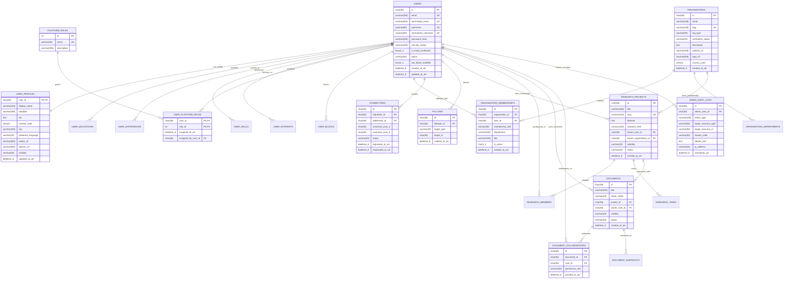

# Pavena — Physical Entity-Relationship Diagram (ERD)

**Document Version:** 1.0  
**Phase:** Phase 1 Foundation Engineering  

```mermaid
erDiagram
    USERS ||--|| USER_PROFILES : has_profile
    USERS ||--o{ USER_EDUCATIONS : attended
    USERS ||--o{ USER_EXPERIENCES : worked_at
    USERS ||--o{ USER_SKILLS : possesses
    USERS ||--o{ USER_INTERESTS : focuses_on
    USERS ||--o{ USER_PLATFORM_ROLES : assigned
    PLATFORM_ROLES ||--o{ USER_PLATFORM_ROLES : grants
    USERS ||--o{ USER_BLOCKS : blocks

    ORGANIZATIONS ||--o{ ORGANIZATION_MEMBERSHIPS : employs
    USERS ||--o{ ORGANIZATION_MEMBERSHIPS : affiliated_with
    ORGANIZATIONS ||--o{ ORGANIZATION_DEPARTMENTS : structured_by

    USERS ||--o{ CONNECTIONS : initiates
    USERS ||--o{ FOLLOWS : follows

    USERS ||--o{ RESEARCH_PROJECTS : owns_individually
    ORGANIZATIONS ||--o{ RESEARCH_PROJECTS : owns_institutionally
    RESEARCH_PROJECTS ||--o{ RESEARCH_MEMBERS : includes
    USERS ||--o{ RESEARCH_MEMBERS : participates_in
    RESEARCH_PROJECTS ||--o{ RESEARCH_TASKS : tracks

    USERS ||--o{ DOCUMENTS : owns_document
    RESEARCH_PROJECTS ||--o{ DOCUMENTS : associates_with
    DOCUMENTS ||--o{ DOCUMENT_COLLABORATORS : authorizes
    USERS ||--o{ DOCUMENT_COLLABORATORS : collaborates_on
    DOCUMENTS ||--o{ DOCUMENT_SNAPSHOTS : versioned_as

    USERS ||--o{ ADMIN_AUDIT_LOGS : actions_recorded

    USERS {
        char(36) id PK
        varchar(255) email UK
        varchar(255) normalized_email UK
        varchar(50) username UK
        varchar(50) normalized_username UK
        varchar(255) password_hash
        varchar(100) security_stamp
        tinyint_1 is_email_confirmed
        varchar(20) status
        tinyint_1 two_factor_enabled
        datetime_6 created_at_utc
        datetime_6 updated_at_utc
    }

    USER_PROFILES {
        char(36) user_id PK, FK
        varchar(150) display_name
        varchar(200) headline
        text bio
        char(2) country_code
        varchar(100) city
        varchar(10) preferred_language
        varchar(500) avatar_url
        varchar(500) banner_url
        varchar(20) visibility
        datetime_6 updated_at_utc
    }

    PLATFORM_ROLES {
        int id PK
        varchar(50) name UK
        varchar(255) description
    }

    USER_PLATFORM_ROLES {
        char(36) user_id PK, FK
        int role_id PK, FK
        datetime_6 assigned_at_utc
        char(36) assigned_by_user_id FK
    }

    ORGANIZATIONS {
        char(36) id PK
        varchar(200) name
        varchar(100) slug UK
        varchar(50) org_type
        varchar(20) verification_status
        text description
        varchar(255) website_url
        varchar(500) logo_url
        char(2) country_code
        datetime_6 created_at_utc
    }

    ORGANIZATION_MEMBERSHIPS {
        char(36) id PK
        char(36) organization_id FK
        char(36) user_id FK
        varchar(50) membership_role
        varchar(100) department
        varchar(100) title
        tinyint_1 is_active
        datetime_6 created_at_utc
    }

    CONNECTIONS {
        char(36) id PK
        char(36) requester_id FK
        char(36) addressee_id FK
        char(36) canonical_user_a
        char(36) canonical_user_b
        varchar(20) status
        datetime_6 requested_at_utc
        datetime_6 responded_at_utc
    }

    FOLLOWS {
        char(36) id PK
        char(36) follower_id FK
        varchar(20) target_type
        char(36) target_id
        datetime_6 created_at_utc
    }

    RESEARCH_PROJECTS {
        char(36) id PK
        varchar(250) title
        varchar(120) slug UK
        text abstract
        varchar(100) research_field
        char(36) owner_user_id FK
        char(36) owner_organization_id FK
        varchar(20) visibility
        varchar(20) status
        datetime_6 created_at_utc
    }

    DOCUMENTS {
        char(36) id PK
        varchar(250) title
        varchar(20) editor_mode
        char(36) project_id FK
        char(36) owner_user_id FK
        varchar(20) visibility
        varchar(20) status
        datetime_6 created_at_utc
    }

    DOCUMENT_COLLABORATORS {
        char(36) id PK
        char(36) document_id FK
        char(36) user_id FK
        varchar(20) permission_role
        datetime_6 granted_at_utc
    }

    ADMIN_AUDIT_LOGS {
        char(36) id PK
        char(36) admin_user_id FK
        varchar(100) action_type
        varchar(50) target_resource_type
        varchar(50) target_resource_id
        varchar(50) reason_code
        text details_json
        varchar(45) ip_address
        datetime_6 timestamp_utc
    }
```
